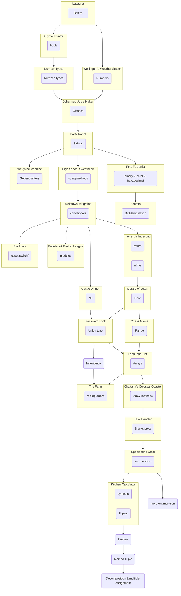

# Concept Tree

This is a concept tree for the Crystal Syllabus. 
It is a work in progress, it was last updated on 2024-01-13.
Each concept with an exercise around it has been implemented, the rest is still to be implemented.

